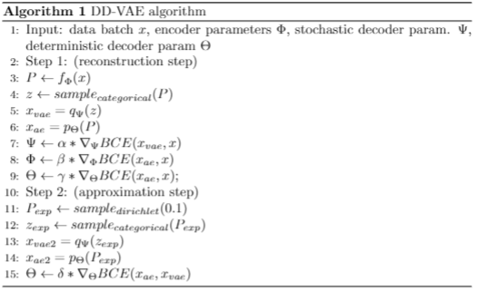

# DD-VAE: Double Decoder VAE

DD-VAE 
1. trains a Variational Autoencoder with discrete latent space 
2. gradients for the encoder and sampling step are approximated by a second deterministic decoder
3. explores latent space via dirichlet sampling

## Algorithm

## Requirements

DD-VAE has the following requirements:

* [Python](https://www.python.org/) - v3.9.15
* [PyTorch](https://pytorch.org/) - v1.12.1
* [TorchVision](https://pytorch.org/vision/stable/index.html) - v0.13.1
* [Weights&Biases](https://wandb.ai/) - v0.13.2

Run the following:

1. !pip install -r Double-Decoder-VAE/environment.txt

2. !pip install wandb

3. cd Double-Decoder-VAE/DD-VAE (Version 2)

## Experiments

To test training you can train a model for 5 epochs first:

!python train.py --epochs 5

or you train a model for 100 epochs

!python train.py